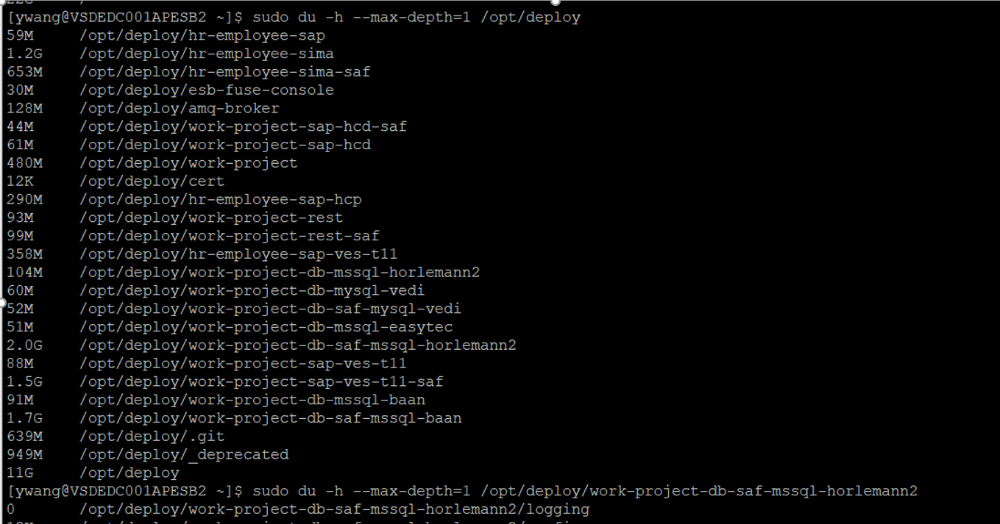

#### 30 find


```

at currentl directory find gz file but exclude path "*deprecated/*" and "./*saf*/*" which contains P.0421285.1.01
find . -name "*.gz" ! -path "*deprecated/*"   ! -path "./*saf*/*" |xargs zgrep -l P.0421285.1.01

```

```
[ywang@VSDEDC001APESB2 deploy]$  find . -name "*.gz" ! -path "*deprecated/*"   ! -path "./*saf*/*" |xargs zgrep -l P.0421285.1.01
./work-project/log/2021-07-21.gz
./work-project-rest/log/2021-07-21.gz
./work-project-db-mssql-horlemann2/log/2021-07-21.gz
./work-project-db-mssql-baan/log/2021-07-21.gz
./work-project-sap-hcp100/log/out.log.2021-07-21.0.gz
./work-project-sap-hcp200/log/out.log.2021-07-23.0.gz
./work-project-sap-hcp400/log/out.log.2021-07-23.0.gz
./work-project-sap-hcp600/log/out.log.2021-07-21.0.gz
./work-project-sap-hcp500/log/out.log.2021-07-21.0.gz
[ywang@VSDEDC001APESB2 deploy]$

[ywang@VSDEDC001APESB2 deploy]$ find . -name "*.gz" ! -path "*deprecated*" ! -path "*saf*" |xargs zgrep -li THOMAS
./hr-employee-sima/log/2021-07-06.gz
./hr-employee-sima/log/2021-07-08.gz
./hr-employee-sima/log/2021-07-13.gz
./hr-employee-sima/log/2021-07-22.gz
./hr-employee-sima/log/2021-07-26.gz
./hr-employee-sima/log/2021-07-28.gz
./hr-employee-sima/log/2021-07-30.gz
./hr-employee-sima/log/2021-08-03.gz
./hr-employee-sima/log/2021-08-04.gz
./hr-employee-sima/log/2021-08-06.gz
./hr-employee-sima/log/2021-08-09.gz
./work-project/log/2021-05-31.gz

find file name ending with gz and contains 08-06 , check if those file contains P.0421572.1.12

[ywang@VSDEDC001APESB2 deploy]$ find . -name "*.gz" -a -name "*08-06*" |xargs zgrep -l P.0421572.1.12
./work-project/log/2021-08-06.gz
./work-project-rest/log/2021-08-06.gz
./work-project-rest-saf/log/2021-08-06.gz
./work-project-db-mssql-horlemann2/log/2021-08-06.gz
./work-project-db-saf-mssql-horlemann2/log/2021-08-06.gz
./work-project-db-mssql-baan/log/2021-08-06.gz
./work-project-db-saf-mssql-baan/log/2021-08-06.gz
./work-project-sap-hcp100/log/out.log.2021-08-06.0.gz
./work-project-sap-hcp100-saf/log/2021-08-06.gz
./work-project-sap-hcp200/log/out.log.2021-08-06.0.gz
./work-project-sap-hcp200-saf/log/2021-08-06.gz
./work-project-sap-hcp400/log/out.log.2021-08-06.0.gz
./work-project-sap-hcp400-saf/log/2021-08-06.gz
./work-project-sap-hcp600/log/out.log.2021-08-06.0.gz
./work-project-sap-hcp600-saf/log/2021-08-06.gz
./work-project-sap-hcp500-saf/log/2021-08-06.gz
./work-project-sap-hcp500/log/out.log.2021-08-06.0.gz
./work-project-sap-t11/log/out.log.2021-08-06.0.gz
./work-project-sap-t11-saf/log/2021-08-06.gz
./work-project-sap-p11/log/out.log.2021-08-06.0.gz
./work-project-sap-p11-saf/log/2021-08-06.gz


```


zgrep -H P.0421285.1.01 ./work-project-sap-hcp100/log/out.log.2021-07-21.0.gz

Search in gz files:

zgrep could search string from gz files from directory as example shown below

find <DIR>  -name “*.gz” |xargs zgrep -H “<SEARCH_PATTERN>”

If you wanted only the list of matching files, use -l:

find <DIR>  -name “*.gz” |xargs zgrep -l “<SEARCH_PATTERN>”


## sudo du -h --max-depth=1 /opt/deploy 


